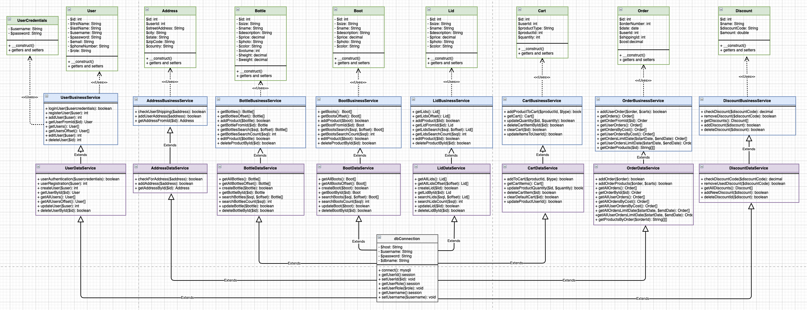
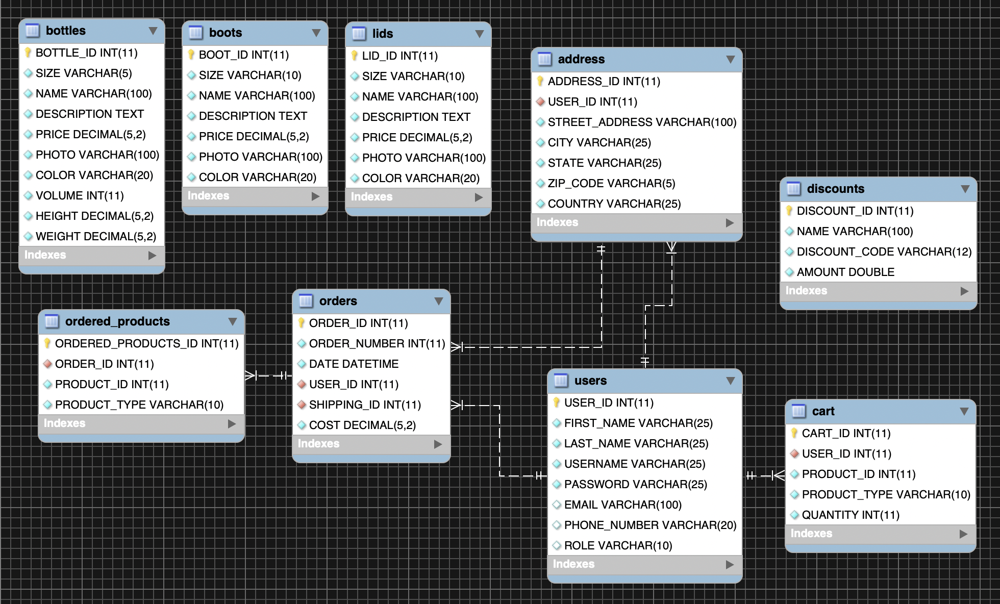

	

# Hydroflask Website - Spring 2020

Using Eclipse and phpMyAdmin, I created a e-commerce web application aiming to replicate the functionality of the Hydroflask website, that allows a user to login or register an account. Within their account, the user is able to shop for products, apply discounts to their cart, and perform a checkout process. Each user account has a role (customer or admin) that corresponds to the features available to that user. The application has a 3 different products public library, containing all of the songs in the database. These songs can be added and removed from specific playlists, and the combination of all of these songs create the user’s song library. The public library, user’s library, and each playlist can all be searched for specific songs. All necessary data for users, products, current carts, and order information was stored in a database using phpMyAdmin, and MAMP was used to host the application locally.

The objective of this project was to build a complete e-commerce web application that met the following requirements:

	1. User Login and Registration Form
	2. Create a Product Catalog and Product Search
	3. Establish User Roles: Admin - User and Product Administration
	4. Maintain a Shopping Cart
	5. Perform a Checkout Process
	6. Generate Sales Reports for Users and Admin - Export JSON
	7. Add Customization - Discounts and Tax/Shipping

<h2>Design</h2>

There were key design decisions that were implemented to make the web application more user friendly. These features included the ability to search for products, the layout of products, and performing auto-fill when a user is logged in (examples are shown in final product screenshots).

The planning for this project included using tools such as a sitemap to determine page navigation and UML diagrams to determine class relationships which is shown below.

<h3>UML Diagram</h3>

	

<h2>Database</h2>

In order for this application to function properly, the use of a database was required. Within the database were tables for user's account information, user addresses, each product (bottles, boots, lids), carts, orders submitted, and a relation table that determines which products were in each order. These tables are all connected through foreign keys besides the products. This is due to the fact that the products are separated into multiple tables so each combination of “PRODUCT_ID” and “PRODUCT_TYPE” in a table corresponds with the appropriate product table. Below is an ER diagram that shows the database.

<h3>ER Diagram<h3>

	

<h2>Final Product</h2>

The final product for this project was a mock e-commerce website for Hydroflasks. Below are some of the completed pages.

<h3>User Web Pages<h3>

	

<h3>Admin Web Pages<h3>

	

